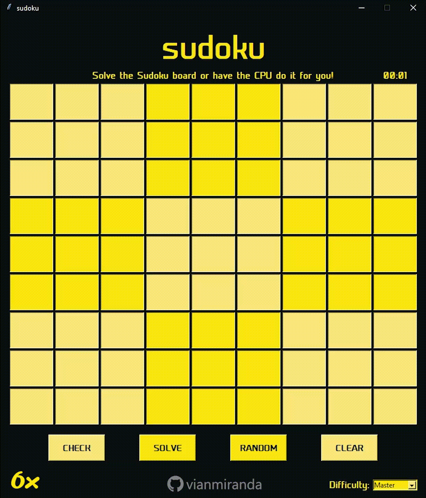

# Sudoku Solver

GUI Sudoku utilizing the tkinter library. 
- Solves any sudoku puzzle input, as long as it is solvable.
- Checks solved sudoku board (automatically if program, button for user if user-solved)

## How To Run
1. Install [Python3](https://www.python.org/downloads/)
2. Install `requirements.txt` file included in the repo: `pip install -r requirements.txt`
3. Go ahead and run: `python src/sudoku.py`

## How It Works
The solver works by using an algorithm known as backtracking. What is backtracking? All backtracking really is the computer bruteforces its way to the solution; however, rather than the normal technique of bruteforcing where it goes through all possible solutions (and nonsolutions), it cuts down on the possibilities by immediately ending the process upon determining that the current path will not result in a solution (in this case due to an invalid integer). It is like a tree, when it fails on a certain branch, it moves on to the next closest possible branch until it exhausts all branches (which is only possible if the input is incorrect).